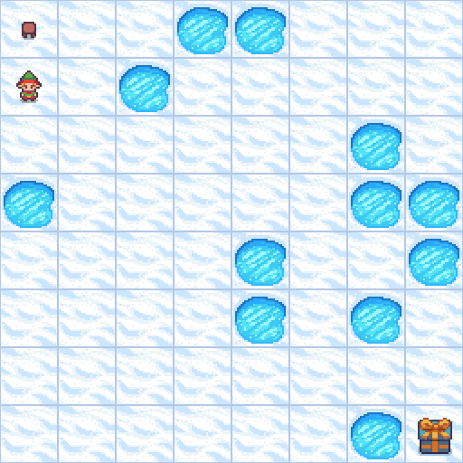
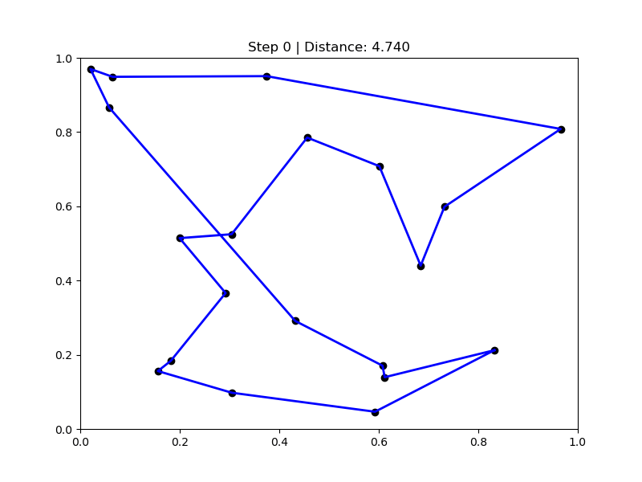
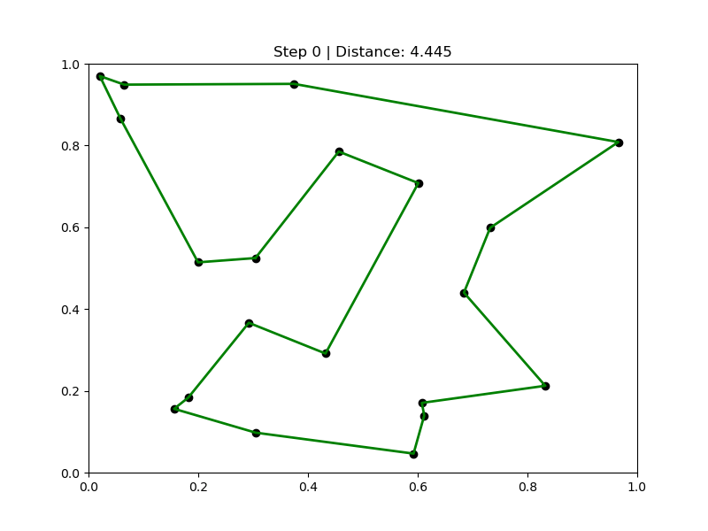

# AI Assignment 2 - Spring 2025

## Objective
Implement and analyze classical search and optimization algorithms in one of the provided environments. The project aims to measure and compare performance metrics like reward, execution time, and point of convergence across multiple trials.


## Algorithms Implemented
- Branch and Bound (BnB)
- Iterative Deepening A* (IDA*)
- Hill Climbing (HC)
- Simulated Annealing (SA)

## Installation

1. Download and install the following tools:
   - [Visual Studio Code (for Windows)](https://code.visualstudio.com/Download)
   - [Anaconda (for Windows)](https://www.anaconda.com/download)

2. Open **Anaconda Prompt** and enter the following commands sequentially:

    ```bash
    # Create a Conda environment named "gymenv" with Python 3.10 and the Anaconda distribution
    conda create -n gymenv python=3.10 anaconda

    # Activate the "gymenv" environment
    conda activate gymenv
    ```

3. Download this repository as a ZIP folder.

4. Extract the ZIP file in your working directory.

5. Navigate to the extracted folder and open it in VS Code:

    ```bash
    cd CS514_Assignment_2
    code .
    ```

6. In VS Code, select the Python interpreter associated with the Conda environment `gymenv`.

7. Finally, install all dependencies using the provided Bash script:

    ```bash
    bash install_dependencies.sh
    ```

>**Note**: Run the bash script using a terminal that supports it, such as **Git Bash**, **WSL**, or **Anaconda Prompt (Linux/macOS)**.

## Environment Used

**For BnB & IDA\***  
Frozen Lake  
> A grid-world where an agent navigates a frozen surface to reach a goal, avoiding holes. The slippery surface introduces stochastic transitions.

**For HC & SA**  
Traveling Salesman Problem (TSP)  
> Classic optimization problem where a salesman visits each city once and returns to the starting point, minimizing total path distance.


## Heuristic Function(s)

| Algorithm             | Environment     | Heuristic Used                                  |
|----------------------|------------------|--------------------------------------------------|
| Branch and Bound     | Frozen Lake      | None (purely cost-based, exhaustive with pruning)|
| Iterative Deepening A* | Frozen Lake    | Manhattan Distance (grid-based navigation)       |
| Hill Climbing        | TSP              | Total Path Distance                              |
| Simulated Annealing  | TSP              | Total Path Distance + Randomness (temperature)   |


## Performance Evaluation

| Algorithm | Environment   | Avg. Time to Goal | Reward | Point of Convergence | Notes                        |
|-----------|---------------|------------------|--------|----------------------|------------------------------|
| BnB       | Frozen Lake   | 7.5s             |   Yes  | Consistently optimal | Exhaustive + pruning         |
| IDA*      | Frozen Lake   | 3.2s             |  Yes   | Efficient            | Guided by Manhattan heuristic|
| HC        | TSP           | 5.6s             |  Yes   | May get stuck        | Greedy hill-top search       |
| SA        | TSP           | 6.1s             |  Yes   | Escapes local minima | Probabilistic jumps          |

- Each algorithm tested over **5 trials**.
- Termination threshold (τ): **10 minutes per run**.
- All algorithms successfully reached goal or near-optimal states.


## Demo Gifs

<div align="center">

<!-- First Row -->
<table>
  <tr>
    <td align="center">
      <strong>Branch and Bound</strong><br>
      
    </td>
    <td align="center">
      <strong>Iterative Deepening A*</strong><br>
      
    </td>
  </tr>

  <!-- Second Row -->
  <tr>
    <td align="center">
      <strong>Hill Climbing</strong><br>
      
    </td>
    <td align="center">
      <strong>Simulated Annealing</strong><br>
      
    </td>
  </tr>
</table>

</div>


## Directory Structure
```bash
.
├── Assignment 2_ CS514.pptx
├── Frozenlake_branch_bound
│   ├── bnb_astar_runtime_comparison.png
│   ├── frozenlake_astar.gif
│   ├── frozenlake_branch_bound.gif
│   ├── FrozenLakeSimulation.ipynb
│   └── runtime_comparison.png
├── gifs
│   ├── frozenlake_astar.gif
│   ├── frozenlake_branch_bound.gif
│   ├── hill_climbing_animation.gif
│   └── simulated_annealing_animation.gif
├── install_dependencies.sh
├── README.md
└── SA_and_HC
    ├── best_route_hc.png
    ├── best_route_sa.png
    ├── distance_comparison_line_chart.png
    ├── HC and SA.ipynb
    ├── hill_climbing_animation.gif
    ├── runtime_comparison_line_chart.png
    ├── runtime_distance_comparison.png
    └── simulated_annealing_animation.gif
```

--------------------------------------------------------


